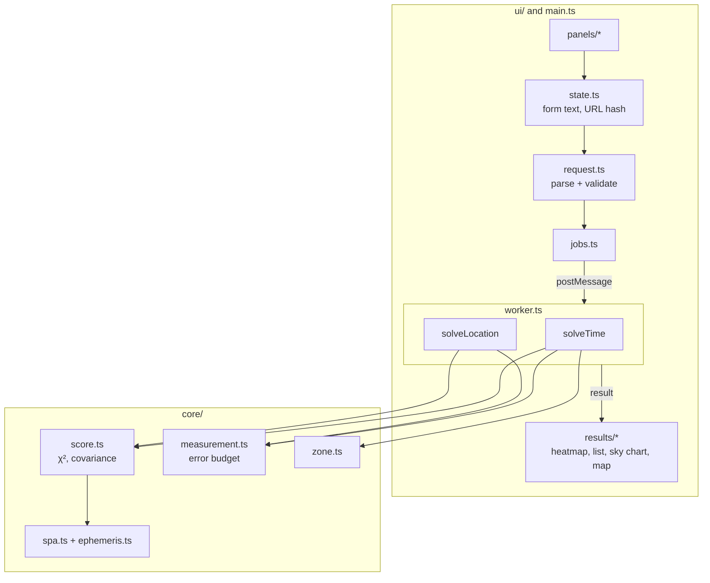

# Architecture

A pure computational **core** with no DOM access, a **worker** that runs the solvers, and a
framework-free **UI**.

| Module | Role |
|---|---|
| `core/spa.ts` | NREL SPA, split into time-only (geocentric) and observer (topocentric) parts |
| `core/ephemeris.ts` | Hourly exact nodes + interpolation of the geocentric part |
| `core/measurement.ts` | Shadow → apparent Sun position with error budget |
| `core/score.ts` | Joint fit of all shadows at one candidate; coarse-search bounds |
| `core/solveTime.ts` | Coarse/fine time search, windows, clusters, heatmap |
| `core/solveLocation.ts` | Coarse-to-fine grid over the Earth, regions |
| `core/claimCheck.ts` | Claimed timestamp, known or scanned UTC offset |
| `core/parse.ts`, `core/zone.ts`, `core/stats.ts` | Parsing, time zones, χ² quantiles |
| `ui/state.ts` | Single state as typed text; URL-hash persistence |
| `ui/request.ts` | The only place where form text becomes numbers |
| `ui/results/*` | Views; charts read theme colours from CSS custom properties |

**Design decisions**
- Grid search with a provable coarse bound instead of analytic inversion: multiple solutions,
  solstice merging and constraint truncation need no special cases.
- Raw text in state: shared links restore exactly what was typed.
- Map tiles are opt-in, because tile requests disclose the area being investigated.
- A strict CSP (`public/_headers`) ensures no script can send case data anywhere.
