# Architecture

ShadowClock follows the house `static-web-app` layout, built on
[static-web-platform](https://github.com/Ben0x0a/static-web-platform) (Git submodule in
`platform/`, pinned to a release). One source (`src/`), two outputs (the installable site
and a single-file download), both built by `npx swp build` into the committed `public/`.

```mermaid
flowchart LR
  subgraph src [src/ — edited]
    site[site.json<br/>id, siteUrl, netOrigins, workers]
    shell[index.html shell]
    core[core/ — pure maths and form rules]
    state[state/ — case, view, solve session]
    ui[ui/ — display helpers, map, i18n]
    features[features/ — one capability each]
    main[main.ts — wiring]
    worker[workers/solver.ts]
  end
  platform[platform/ — static-web-platform<br/>consent, storage, share, dialogs, build, gate]
  subgraph out [public/ — generated, committed]
    siteOut[index.html + app.js/css + workers/solver.js<br/>installable site]
    single[shadowclock.html<br/>single file, worker inlined]
  end
  src --> platform --> out
```



## Layers (checked by `swp build`)

| Layer | Contents | May import |
|---|---|---|
| `core/` | NREL SPA (`spa.ts`, `ephemeris.ts`, `deltaT.ts`), measurement → Sun position (`measurement.ts`), scoring and solvers (`score.ts`, `solveTime.ts`, `solveLocation.ts`, `claimCheck.ts`), parsing and zones, the form (`form.ts`: types, defaults, validation of shared cases), `request.ts` (the only place where text becomes numbers), `examples.ts`, the worker protocol | `core/` only (no DOM, no platform) |
| `workers/solver.ts` | Runs the solvers off the main thread (`platform.worker("solver")`) | `core/` |
| `state/` | `case.ts` (the working case, tab storage), `view.ts` (guided/expert), `solve.ts` (debounced solving in the worker, latest result) | `core/`, the platform |
| `ui/` | `dom.ts` (+ `controls.css`), `format.ts`, `colours.ts`, `budget.ts`, `map.ts` (Leaflet, consent first), `toast.ts`, `context.ts` (`t()`, `tm()`) | `core/`, the platform |
| `features/` | `inputs` (start screen, guided steps, expert panels), `results` (time and place answers, year map, sun path), `claim`, `mode-tabs`, `examples`, `share-export`, `help`, `toolbar` | `core/`, `ui/`, `state/`, the platform; never another feature |
| `main.ts` | Starts the platform, creates the state, mounts and wires the features | everything except data |

## Runtime

```mermaid
flowchart TD
  P[platform: t(), stores, consent, share,<br/>Install / Download / Privacy / Accessibility] --> M
  M[main.ts] --> F[features] --> S[state/solve.ts]
  S -->|postMessage| W[workers/solver.js: solveTime / solveLocation]
  W -->|result + message keys| S --> F
  F -->|consent.request, then Leaflet| OSM[(tile.openstreetmap.org)]
```

The core returns message keys, never text (it also runs in the worker); `ui/context.ts`
translates them. Each feature brings its own CSS; `app.css` holds the tokens, the page
layout and the cross-cutting rules (phones, dialogs, forced colours, print).

**Design decisions** are listed in the README (*Design decisions*).
