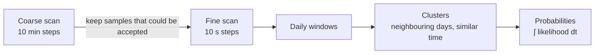

# Method

## From a shadow to a Sun position

For a vertical object of height *H* casting a shadow of length *L* on level ground, the
apparent Sun elevation is

  h = atan(H / L)

and the Sun's azimuth is the shadow's azimuth + 180°. Every input form (lengths, ratio,
angle) is reduced to this apparent position with an **error budget**:

| Term | Gaussian (`± σ`) | Range (`min–max`) |
|---|---|---|
| Lengths | σh² = (L²σH² + H²σL²) / (H² + L²)² (first order) | [atan(Hmin/Lmax), atan(Hmax/Lmin)] |
| Penumbra: the Sun is a 0.53° disc, so the tip is a gradient | unknown edge: uniform ±0.267° → σ = 0.267/√3; midpoint: ±0.133° | ± 0.267° / ± 0.133° |
| Sharp (umbra) or faint (outer) edge measured | centre shifted by −/+ 0.267°, no extra term | same |
| Object tilt up to τ | elevation σ = τ/√3; azimuth σ = atan(sin τ · tan h)/√3 | ± τ; ± atan(sin τ · tan h) |
| Refraction model | 10 % of Bennett's refraction at *h* (1σ) | ± 20 % |
| Azimuth reading | as given (after magnetic declination) | as given |

Gaussian terms add in quadrature; range terms add linearly (worst case).

## Sun position

The NREL Solar Position Algorithm (Reda & Andreas 2004; ±0.0003°) gives the apparent
topocentric elevation (with refraction for the given pressure and temperature) and azimuth.
Geocentric terms are computed exactly at whole hours and linearly interpolated in between
(error < 1e-5°, tested). ΔT follows the Espenak–Meeus polynomials; one second of ΔT moves the
Sun by only about 0.004°.

## Scoring a candidate

For a candidate (time, place), each shadow gives residuals *r* between the predicted and the
measured Sun. Uncertainty on the *known* side (the location radius *R* in time mode, the time
of each photo) is propagated through the local Jacobian *J* of (elevation, azimuth):

  C = diag(σ²) + J Σ Jᵀ,  χ² = rᵀ C⁻¹ r

A uniform disc of radius *R* has per-axis σ = R/2. Shadows are independent, so χ² and the
degrees of freedom add. Range components are hard bounds, widened by |∂/∂t|·Δt + R·|∇|.

A candidate is **accepted** inside the 99.73 % region (χ² ≤ χ²₀.₉₉₇₃(k)) and inside every
bound. Reported regions: 68.27 / 95.45 / 99.73 %, from the χ² quantiles for *k* degrees of
freedom.

## Searching

The coarse scan cannot miss a solution: it keeps a sample whenever the Sun lies within the
largest distance an accepted position can have, plus the distance the Sun can move in half a
step (0.2507°/min, with a safety factor). The same argument, applied to observer
displacement, makes the location grid search exhaustive.

## Probabilities

Cluster probabilities integrate the likelihood exp(−χ²/2)/√det C over time (or over area
in place mode), assuming every allowed instant (or place) was equally likely beforehand.
They compare solutions relative to each other; they do not say whether the measurements
are correct.

## Assumptions and limits

- The object is vertical within the stated tilt, and the ground is flat and level.
- Lengths and azimuths come from the real scene or a rectified image. Perspective in a raw
  photo is **not** corrected.
- Azimuths are relative to true north.
- Refraction assumes a standard atmosphere, scaled by pressure and temperature; below about
  5° elevation it becomes unreliable, and the app warns.
- The Sun's path repeats every year: the year is never determined by shadows.
