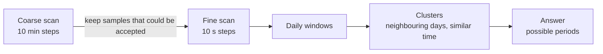

# Method

## From a shadow to a Sun position

For a vertical object of height *H* casting a shadow of length *L* on level ground, the
apparent Sun elevation is

  h = atan(H / L)

and the Sun's azimuth is the shadow's azimuth + 180°.

### Declared tolerances as hard bounds

Every input is *value ± tolerance*, where the tolerance is declared by the operator: the
largest error considered possible. No statistical distribution is assumed. Each input
therefore defines an interval, and ShadowClock propagates intervals:

| Term | Bound on the Sun position |
|---|---|
| Lengths | h ∈ [atan(Hmin/Lmax), atan(Hmax/Lmin)] (atan is monotonic) |
| Penumbra: the Sun is a 0.53° disc, so the tip is a gradient | unknown edge: ± 0.267°; midpoint: ± 0.133°; sharp (umbra) or faint (outer) edge: centre shifted by −/+ 0.267° |
| Object tilt up to τ | elevation ± τ; azimuth ± atan(sin τ · tan h) |
| Refraction model | ± 20 % of Bennett's refraction at *h* |
| Direction | declared tolerance (after magnetic declination) |

Bounds add linearly (worst case). The error budget in the app lists each term.

## Sun position

The NREL Solar Position Algorithm (Reda & Andreas 2004; ±0.0003°) gives the apparent
topocentric elevation (with refraction for the given pressure and temperature) and azimuth.
Geocentric terms are computed exactly at whole hours and linearly interpolated in between
(error < 1e-5°, tested). ΔT follows the Espenak–Meeus polynomials; one second of ΔT moves the
Sun by only about 0.004°.

## Scoring a candidate

For a candidate (time, place), each shadow gives residuals between the predicted and the
measured Sun. The tolerance on the *known* side (the location radius *R* in time mode, the
time gap or time of each photo) widens each bound through the local derivatives of the
Sun's elevation and azimuth:

  half-width = declared + physical terms + |∂/∂t|·Δt + R·|∇|

A candidate is **possible** when every residual lies inside its half-width, for every shadow.

The core also implements a Gaussian model (value ± σ, χ² with covariance propagation and
68 / 95 / 99.7 % regions). The web app does not expose it: all inputs are declared bounds.

## Searching

The coarse scan cannot miss a solution: it keeps a sample whenever the Sun lies within the
largest distance a possible position can have, plus the distance the Sun can move in half a
step (0.2507°/min, with a safety factor). The same argument, applied to observer
displacement, makes the location grid search exhaustive.

## Assumptions and limits

- The object is vertical within the stated tilt, and the ground is flat and level.
- Lengths and azimuths come from the real scene or a rectified image. Perspective in a raw
  photo is **not** corrected.
- Azimuths are relative to true north.
- Refraction assumes a standard atmosphere, scaled by pressure and temperature; below about
  5° elevation it becomes unreliable, and the app warns.
- The Sun's path repeats every year: the year is never determined by shadows.
